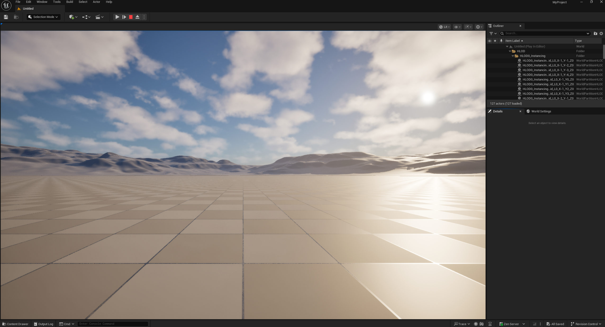
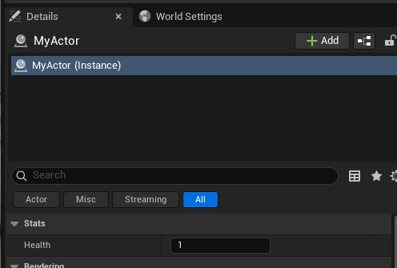

I managed to create and run a basic c++ project


The reflected class is this

```c++
class MYPROJECT_API AMyActor : public AActor
{
	GENERATED_BODY()
}
```


And the reflected property is this

```c++
public:	
	// Sets default values for this actor's properties
	AMyActor();
	UPROPERTY(EditAnywhere, BlueprintReadWrite, Category = "Stats")
	int Health = 1;
```

The reflected property will show up in the details panel

