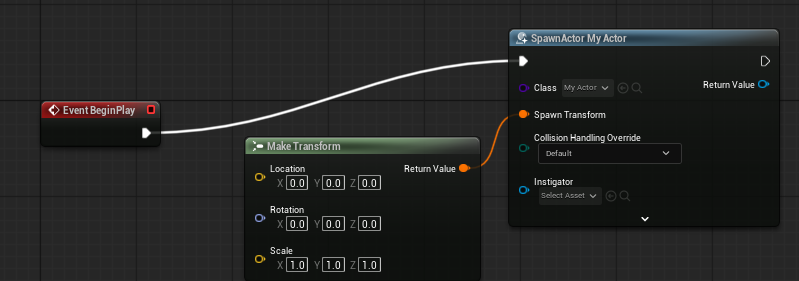
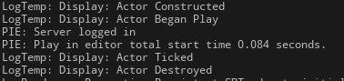

The actor is spawned at runtime using the level blueprint:



Actor output:



This shows the actor constructing then beginning play. After play has begun it then ticks and destroys itself, showing the destroyed message.

cpp file for the actor
```cpp
#include "MyActor.h"

// Sets default values
AMyActor::AMyActor()
{
 	// Set this actor to call Tick() every frame.  You can turn this off to improve performance if you don't need it.
	PrimaryActorTick.bCanEverTick = true;

}

//Called when the actor is constructed
void AMyActor::OnConstruction(const FTransform& Transform)
{
	Super::OnConstruction(Transform);
	UE_LOG(LogTemp, Display, TEXT("Actor Constructed"));
}


// Called when the game starts or when spawned
void AMyActor::BeginPlay()
{
	Super::BeginPlay();
	UE_LOG(LogTemp, Display, TEXT("Actor Began Play"));
}

// Called every frame
void AMyActor::Tick(float DeltaTime)
{
	Super::Tick(DeltaTime);

	UE_LOG(LogTemp, Display, TEXT("Actor Ticked"));

	this->Destroy();
}

//Called when the actor is destroyed
void AMyActor::EndPlay(const EEndPlayReason::Type EndPlayReason) 
{
	UE_LOG(LogTemp, Display, TEXT("Actor Destroyed"));
	FActorSpawnParameters Params;
	Super::EndPlay(EndPlayReason);

}

```

header file for the actor
```cpp
#pragma once

#include "CoreMinimal.h"
#include "GameFramework/Actor.h"
#include "MyActor.generated.h"

UCLASS()
class MYPROJECT_API AMyActor : public AActor
{
	GENERATED_BODY()
	
public:	
	// Sets default values for this actor's properties
	AMyActor();

protected:
	//Called when the actor is constructed
	virtual void OnConstruction(const FTransform& Transform) override;

	// Called when the game starts or when spawned
	virtual void BeginPlay() override;

	// Called when actor destroyed
	virtual void EndPlay(const EEndPlayReason::Type EndPlayReason) override;

public:	
	// Called every frame
	virtual void Tick(float DeltaTime) override;

};
```