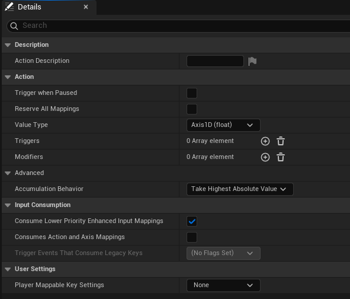
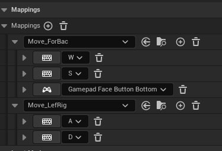
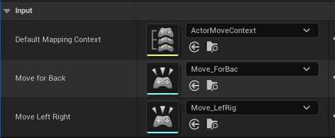
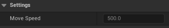

This task was to implement an enhanced input action in C++

I used a basic c++ pawn with a simple cube mesh, and gave it basic wasd controls to move. The enhanced input system uses a mapping context and input actions, which are then bound to functions in the pawn

```cpp
//Activate player controller and input mapping
if (GetWorld())
{
	APlayerController* PC = GetWorld()->GetFirstPlayerController();

	if (PC)
	{
		DefaultMappingContext = Cast<UInputMappingContext>(StaticLoadObject(UInputMappingContext::StaticClass(), nullptr, TEXT("/Game/Inputs/ActorMoveContext.ActorMoveContext")));
		MoveForBack = Cast<UInputAction>(StaticLoadObject(UInputAction::StaticClass(), nullptr, TEXT("/Game/Inputs/Move_ForBac.Move_ForBac")));
		MoveLeftRight = Cast<UInputAction>(StaticLoadObject(UInputAction::StaticClass(), nullptr, TEXT("/Game/Inputs/Move_LefRig.Move_LefRig")));

		if (ULocalPlayer* LocalPlayer = PC->GetLocalPlayer())
		{
			if (UEnhancedInputLocalPlayerSubsystem* Subsystem = ULocalPlayer::GetSubsystem<UEnhancedInputLocalPlayerSubsystem>(LocalPlayer))
			{
				if (DefaultMappingContext)
				{
					Subsystem->AddMappingContext(DefaultMappingContext, 10);
				}
			}
		}

		EnableInput(PC);

	}
}

---

//Bind input actions to movement functions
void AMyMovingActor::SetupPlayerInputComponent(UInputComponent* PlayerInputComponent)
{
	Super::SetupPlayerInputComponent(PlayerInputComponent);

	if (UEnhancedInputComponent* EnhancedInput = Cast<UEnhancedInputComponent>(PlayerInputComponent))
	{
		EnhancedInput->BindAction(MoveForBack, ETriggerEvent::Triggered, this, &AMyMovingActor::HandleMoveFor);
		EnhancedInput->BindAction(MoveLeftRight, ETriggerEvent::Triggered, this, &AMyMovingActor::HandleMoveStrafe);
	}
}
```

And then these functions move the actor:
```cpp
//Move forward/backward
void AMyMovingActor::HandleMoveFor(const FInputActionValue& Value) 
{
    if (CollisionBox)
    {
		float DeltaX = Value.Get<float>() * MoveSpeed * GetWorld()->GetDeltaSeconds();
		FVector DeltaLocation = FVector(DeltaX, 0.0f, 0.0f);
		AddActorLocalOffset(DeltaLocation, true);
    }
}

//Move left/right
void AMyMovingActor::HandleMoveStrafe(const FInputActionValue& Value)
{
	if (CollisionBox)
	{
		float DeltaY = Value.Get<float>() * MoveSpeed * GetWorld()->GetDeltaSeconds();
		FVector DeltaLocation = FVector(0.0f, DeltaY, 0.0f);
		AddActorLocalOffset(DeltaLocation, true);
	}
}
```

The ehanced input system uses two input actions which both have 1 axis floats as the input value:



It can also be configured to allow inputs from other device types or different keybinds. The gamepad keybind isn't used in the final version, but is shown in this screenshot to demonstrate that it's possible to include other devices



---

The pawn also uses reflection to allows some configuration from the editor. Though this has limited usage in this case since the base state of c++ classes don't seem to be configurable through the editor, only in the code. And in this case the actor is instantiated from the base class as the player character, which can be configured once in game but not as the base class.

This is reflection of the enhanced input mapping:



The more useful reflection is the actor speed:



And finally, A short video clip to demonstrate it working:


---

I believe that covers all criteria for this task; Enhanced input system whith simple movement, show how it can accomodate different devices, and show reflection of variables in the editor.

I'll include the full code of both the .ccp and the .h of the pawn class here:

.ccp
```cpp
#include "MyMovingActor.h"
#include "Components/BoxComponent.h"
#include "Components/StaticMeshComponent.h"
#include "EnhancedInputComponent.h"
#include "EnhancedInputSubsystems.h"
#include "GameFramework/SpringArmComponent.h"
#include "Camera/CameraComponent.h"
#include "Engine/EngineTypes.h"

struct FInputActionValue;

// Sets default values
AMyMovingActor::AMyMovingActor()
{
 	// Set this actor to call Tick() every frame.  You can turn this off to improve performance if you don't need it.
	PrimaryActorTick.bCanEverTick = true;

	AutoReceiveInput = EAutoReceiveInput::Player0;
	AutoPossessPlayer = EAutoReceiveInput::Player0;


	//Activate player controller and input mapping
	if (GetWorld())
	{
		APlayerController* PC = GetWorld()->GetFirstPlayerController();

		if (PC)
		{
			DefaultMappingContext = Cast<UInputMappingContext>(StaticLoadObject(UInputMappingContext::StaticClass(), nullptr, TEXT("/Game/Inputs/ActorMoveContext.ActorMoveContext")));
			MoveForBack = Cast<UInputAction>(StaticLoadObject(UInputAction::StaticClass(), nullptr, TEXT("/Game/Inputs/Move_ForBac.Move_ForBac")));
			MoveLeftRight = Cast<UInputAction>(StaticLoadObject(UInputAction::StaticClass(), nullptr, TEXT("/Game/Inputs/Move_LefRig.Move_LefRig")));

			if (ULocalPlayer* LocalPlayer = PC->GetLocalPlayer())
			{
				if (UEnhancedInputLocalPlayerSubsystem* Subsystem = ULocalPlayer::GetSubsystem<UEnhancedInputLocalPlayerSubsystem>(LocalPlayer))
				{
					if (DefaultMappingContext)
					{
						Subsystem->AddMappingContext(DefaultMappingContext, 10);
					}
				}
			}

			EnableInput(PC);

		}
	}

	//Create collision and size
	CollisionBox = CreateDefaultSubobject<UBoxComponent>(TEXT("CollisionBox"));
	SetRootComponent(CollisionBox);
	CollisionBox->SetBoxExtent(FVector(50.f, 50.f, 50.f));
	CollisionBox->SetCollisionProfileName(TEXT("Actor"));

	//Set mesh to basic cube
	MeshComponent = CreateDefaultSubobject<UStaticMeshComponent>(TEXT("MeshComponent"));
	MeshComponent->SetupAttachment(RootComponent);

	static ConstructorHelpers::FObjectFinder<UStaticMesh> CubeMeshAsset(TEXT("/Engine/BasicShapes/Cube.Cube"));

	//Check if cube found
	if (CubeMeshAsset.Succeeded())
	{
		MeshComponent->SetStaticMesh(CubeMeshAsset.Object);
	}


	CollisionBox->SetSimulatePhysics(true);

	//position camera
	CameraBoom = CreateDefaultSubobject<USpringArmComponent>(TEXT("CameraBoom"));
	CameraBoom->SetupAttachment(RootComponent);
	CameraBoom->TargetArmLength = 400.0f;
	CameraBoom->SetRelativeRotation(FRotator(-15.0f, 0.0f, 0.0f));

	FollowCamera = CreateDefaultSubobject<UCameraComponent>(TEXT("FollowCamera"));
	FollowCamera->SetupAttachment(CameraBoom, USpringArmComponent::SocketName);
}

//Bind input actions to movement functions
void AMyMovingActor::SetupPlayerInputComponent(UInputComponent* PlayerInputComponent)
{
	Super::SetupPlayerInputComponent(PlayerInputComponent);

	if (UEnhancedInputComponent* EnhancedInput = Cast<UEnhancedInputComponent>(PlayerInputComponent))
	{
		EnhancedInput->BindAction(MoveForBack, ETriggerEvent::Triggered, this, &AMyMovingActor::HandleMoveFor);
		EnhancedInput->BindAction(MoveLeftRight, ETriggerEvent::Triggered, this, &AMyMovingActor::HandleMoveStrafe);
	}
}

//Move forward/backward
void AMyMovingActor::HandleMoveFor(const FInputActionValue& Value) 
{
    if (CollisionBox)
    {
		float DeltaX = Value.Get<float>() * MoveSpeed * GetWorld()->GetDeltaSeconds();
		FVector DeltaLocation = FVector(DeltaX, 0.0f, 0.0f);
		AddActorLocalOffset(DeltaLocation, true);
    }
}

//Move left/right
void AMyMovingActor::HandleMoveStrafe(const FInputActionValue& Value)
{
	if (CollisionBox)
	{
		float DeltaY = Value.Get<float>() * MoveSpeed * GetWorld()->GetDeltaSeconds();
		FVector DeltaLocation = FVector(0.0f, DeltaY, 0.0f);
		AddActorLocalOffset(DeltaLocation, true);
	}
}

// Called when the game starts or when spawned
void AMyMovingActor::BeginPlay()
{
	Super::BeginPlay();
	
}

// Called every frame
void AMyMovingActor::Tick(float DeltaTime)
{
	Super::Tick(DeltaTime);

}
```

.h
```cpp
// Fill out your copyright notice in the Description page of Project Settings.

#pragma once

#include "CoreMinimal.h"
#include "GameFramework/Actor.h"
#include "EnhancedInputComponent.h"
#include "InputMappingContext.h"
#include "InputAction.h"
#include "MyMovingActor.generated.h"


class UBoxComponent;
class UStaticMeshComponent;
class USpringArmComponent;
class UCameraComponent;


UCLASS()
class RESIT_3_API AMyMovingActor : public APawn
{
	GENERATED_BODY()
	
public:	
	// Sets default values for this actor's properties
	AMyMovingActor();

	UPROPERTY(VisibleAnywhere, BlueprintReadOnly, Category = "Settings")
	float MoveSpeed = 500.f;


protected:
	// Called when the game starts or when spawned
	virtual void BeginPlay() override;

	virtual void SetupPlayerInputComponent(class UInputComponent* PlayerInputComponent) override;

	UPROPERTY(VisibleAnywhere, BlueprintReadOnly, Category = "Components")
	UBoxComponent* CollisionBox;

	UPROPERTY(VisibleAnywhere, BlueprintReadOnly, Category = "Components")
	UStaticMeshComponent* MeshComponent;

	UPROPERTY(VisibleAnywhere, BlueprintReadOnly, Category = "Components")
	USpringArmComponent* CameraBoom;

	UPROPERTY(VisibleAnywhere, BlueprintReadOnly, Category = "Components")
	UCameraComponent* FollowCamera;


	UPROPERTY(EditAnywhere, BlueprintReadOnly, Category = "Input")
	UInputMappingContext* DefaultMappingContext;

	UPROPERTY(EditAnywhere, BlueprintReadOnly, Category = "Input")
	UInputAction* MoveForBack;

	UPROPERTY(EditAnywhere, BlueprintReadOnly, Category = "Input")
	UInputAction* MoveLeftRight;

	void HandleMoveFor(const FInputActionValue& Value);

	void HandleMoveStrafe(const FInputActionValue&);


public:
	// Called every frame
	virtual void Tick(float DeltaTime) override;

};
```