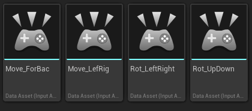
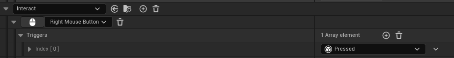
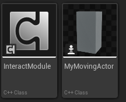
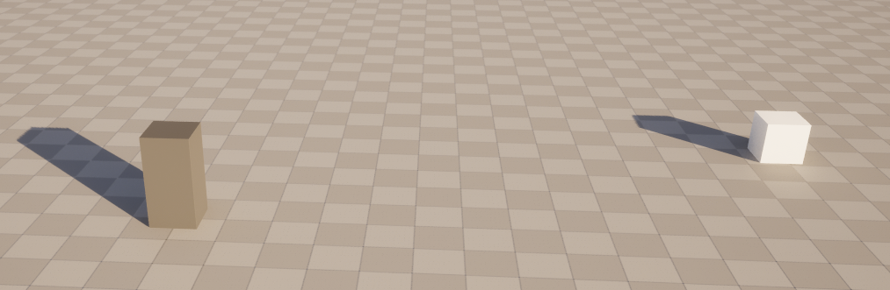
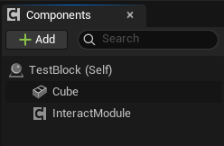
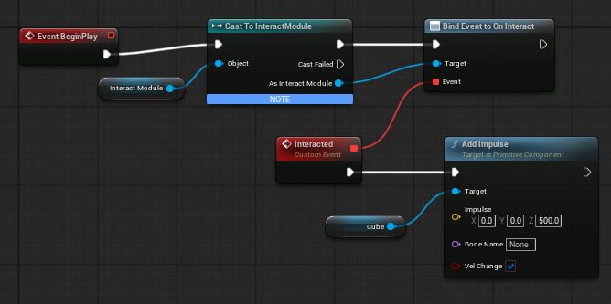

For this task, I did re-use task 3 as a base since it had basic movement setup already. On top of that I added mouse movements and increased the size of the player to allow for a first person controller



Then I added a right click keybind and linked it to a raycast function



```cpp
void AMyMovingActor::HandleInteract(const FInputActionValue& Value)
{
	FVector RayStart = FollowCamera->GetComponentLocation();
	FVector ForwardVector = FollowCamera->GetForwardVector();

	float maxDistance = 1000.0f; // Set the maximum distance for the raycast
	FVector RayEnd = RayStart + (ForwardVector * maxDistance);

	FHitResult HitResult;

	bool bHit = GetWorld()->LineTraceSingleByChannel(HitResult, RayStart, RayEnd, ECC_Visibility);
	DrawDebugLine(GetWorld(), RayStart, RayEnd, FColor::Red, false, 2.0f, 0, 1.0f);

	if (bHit) 
	{
		AActor* HitActor = HitResult.GetActor();
		UInteractModule* InteractableComp = HitActor->FindComponentByClass<UInteractModule>();

		if (InteractableComp) 
		{
			InteractableComp->TriggerInteraction();
		}
	}
}
```

the function creates a raycast, with a line debug for this task to help with demonstration. It then finds the c++ interact module on whatever it hit, and if it finds it, it will trigger it.

I made the c++ actor module which is pretty simple, with just a function to trigger



the modules header:

```cpp
#pragma once

#include "CoreMinimal.h"
#include "Components/ActorComponent.h"
#include "InteractModule.generated.h"

DECLARE_DYNAMIC_MULTICAST_DELEGATE(FOnInteractSignature);

UCLASS( ClassGroup=(Custom), meta=(BlueprintSpawnableComponent) )
class RESIT_3_API UInteractModule : public UActorComponent
{
	GENERATED_BODY()

public:	
	// Sets default values for this component's properties
	UInteractModule();

	UPROPERTY(BlueprintAssignable, Category = "Interaction")
	FOnInteractSignature OnInteract;

	UFUNCTION(BlueprintCallable, Category = "Interaction")
	void TriggerInteraction();

protected:
	// Called when the game starts
	virtual void BeginPlay() override;
};
```

And the modules main cpp:

```cpp
#include "InteractModule.h"

// Sets default values for this component's properties
UInteractModule::UInteractModule()
{
	PrimaryComponentTick.bCanEverTick = false;
}


// Called when the game starts
void UInteractModule::BeginPlay()
{
	Super::BeginPlay();
}

void UInteractModule::TriggerInteraction()
{
	OnInteract.Broadcast();
}
```

I then made a blueprint actor to use the module, which is a simple cube. When interacted with it will jump in the air slightly

FPS character on the left, interactable on the right



The blueprint actor, showing use of the cube and module



And finally the blueprint linking the module to an event in the blueprint:



Here's a gif as a short demonstration of it working

